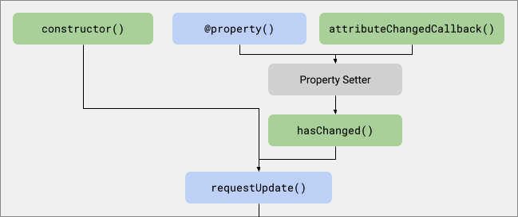
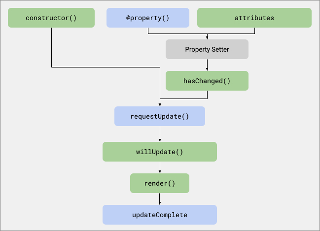

# 生命周期 (Lifecycle)

Lit 组件使用标准的自定义元素生命周期方法。此外，Lit 还引入了一个响应式更新周期，当响应式属性发生变化时，该周期会渲染 DOM 的变化。

## 标准自定义元素生命周期

Lit 组件是标准的自定义元素，并继承了自定义元素的生命周期方法。有关自定义元素生命周期的更多信息，请参阅 MDN 上的 [使用生命周期回调](https://developer.mozilla.org/en-US/docs/Web/Web_Components/Using_custom_elements)。

如果需要自定义任何标准的自定义元素生命周期方法，请确保调用 `super` 实现（例如 `super.connectedCallback()`），以便保持标准的 Lit 功能。

### constructor()

在元素创建时调用。当现有元素被升级时（即在元素已经存在于 DOM 中时加载了自定义元素定义），也会被调用。

#### Lit 行为

- 使用 `requestUpdate()` 方法请求异步更新，因此当 Lit 组件被升级时，它会立即执行一次更新。
- 保存已设置在元素上的任何属性。这可以确保在升级前设置的值被保留，并正确地覆盖组件中设置的默认值。

#### 用例

执行第一次更新之前必须完成的一次性初始化任务。例如，当不使用装饰器时，可以在构造函数中设置属性的默认值，如下所示：

```javascript
constructor() {
  super();
  this.foo = 'foo';
  this.bar = 'bar';
}
```

### connectedCallback()

当组件被添加到文档的 DOM 中时调用。

#### Lit 行为

- Lit 在元素连接后启动第一次元素更新周期。为了准备渲染，Lit 还会确保 `renderRoot`（通常是 `shadowRoot`）已被创建。
- 一旦元素至少连接到文档一次，组件的更新将继续进行，无论元素的连接状态如何。

#### 用例

在 `connectedCallback()` 中，应该设置仅在元素连接到文档时才应执行的任务。这些任务通常包括向元素外部的节点（例如 `window`）添加事件监听器。通常，`connectedCallback()` 中执行的所有操作都应该在元素断开连接时撤销 —— 例如，从 `window` 中移除事件监听器以防止内存泄漏。

```javascript
connectedCallback() {
  super.connectedCallback();
  window.addEventListener('keydown', this._handleKeydown);
}
```

### disconnectedCallback()

当组件从文档的 DOM 中移除时调用。

#### Lit 行为

- 暂停响应式更新周期。当元素重新连接时恢复更新。

#### 用例

此回调是元素的主要信号，表示该元素可能不再被使用。因此，`disconnectedCallback()` 应确保没有任何内容仍然引用该元素（例如添加到元素外部节点的事件监听器），以便该元素能够被垃圾回收。因为元素在断开连接后可能会被重新连接（例如在元素在 DOM 中移动或缓存时），任何此类引用或监听器可能需要通过 `connectedCallback()` 重新建立，以便在这些场景中元素能够正常工作。例如，可以移除添加到 `window` 的事件监听器，如 `keydown` 事件处理程序。

```javascript
disconnectedCallback() {
  super.disconnectedCallback();
  window.removeEventListener('keydown', this._handleKeydown);
}
```

> **注意：** 不需要移除组件自身 DOM 中的内部事件监听器 —— 包括在模板中声明的事件监听器。与外部事件监听器不同，它们不会阻止组件被垃圾回收。

### attributeChangedCallback()

当元素的 `observedAttributes` 中的某个属性发生变化时调用。

#### Lit 行为

- Lit 使用此回调将属性的变化同步到响应式属性中。具体来说，当设置属性时，会相应地设置对应的属性值。Lit 还会自动将元素的 `observedAttributes` 数组与组件的响应式属性列表匹配。

#### 用例

通常不需要实现此回调。

### adoptedCallback()

当组件移动到新的文档中时调用。

> **注意：** `adoptedCallback` 不受 polyfill 支持。

#### Lit 行为

- Lit 对此回调没有默认行为。

#### 用例

此回调应仅用于高级用例，例如当元素移动到新文档时，元素的行为需要发生变化时。


## 响应式更新周期 (Reactive update cycle)

除了标准的自定义元素生命周期，Lit 组件还实现了一个响应式更新周期。

当响应式属性发生变化或显式调用 `requestUpdate()` 方法时，会触发响应式更新周期。Lit 以异步方式执行更新，因此属性的变化会被批量处理 —— 如果在请求更新之后但在更新开始之前有更多属性发生变化，所有变化都会在同一个更新中捕获。

更新发生在微任务（microtask）时机，这意味着它会在浏览器绘制下一帧到屏幕之前发生。有关浏览器时机的更多信息，请参阅 [Jake Archibald 的 microtasks 文章](https://jakearchibald.com/2015/tasks-microtasks-queues-and-schedules/)。


#### 响应式更新周期的高级流程：

1. 当一个或多个属性发生变化或调用 `requestUpdate()` 时，计划一次更新。
2. 更新在下一帧绘制之前执行。
  - 设置反映属性（Reflecting attributes）。
  - 调用组件的 `render` 方法以更新其内部 DOM。
3. 更新完成，并解析 `updateComplete` Promise。

在更详细的层次上，它看起来像这样：

**更新前（Pre-Update）**  


**更新中（Update）**  

**更新后（Post-Update）**


### 已更改的属性映射 (The changedProperties map)

许多响应式更新方法接收一个包含已更改属性的 `Map`。`Map` 的键是属性名称，值是之前的属性值。你可以始终使用 `this.property` 或 `this[property]` 找到当前的属性值。

#### 已更改属性的TypeScript(TypeScript types for changedProperties)

如果你使用 TypeScript，并且希望对 `changedProperties` 映射表进行强类型检查，可以使用 `PropertyValues<this>`，它会推断每个属性名称的正确类型。

```typescript
import {LitElement, html, PropertyValues} from 'lit';
...
shouldUpdate(changedProperties: PropertyValues<this>) {
  ...
}
```

如果你不太关注强类型检查，或者只检查属性名称而不检查之前的值，可以使用不那么严格的类型 `Map<string, any>`。

> 请注意：`PropertyValues<this>` 不会识别受保护的或私有的属性。如果你要检查任何受保护或私有的属性，则需要使用更不严格的类型。

#### 更新过程中更改属性 (Changing properties during an update)

在更新期间（包括 `render()` 方法），更改某个属性会更新 `changedProperties` 映射表，但不会触发新的更新。更改属性发生在 `render()` 之后（例如在 `updated()` 方法中），会触发新的更新周期，并将更改的属性添加到新的 `changedProperties` 映射表中，以供下一周期使用。

### 触发更新 (Triggering an update)

当响应式属性发生变化或调用 `requestUpdate()` 方法时，会触发一次更新。由于更新是异步执行的，因此在更新执行之前发生的任何变化都会导致仅一次更新。

#### hasChanged()

当设置响应式属性时调用。默认情况下，`hasChanged()` 会执行严格相等性检查，如果返回 `true`，则计划一次更新。有关配置 `hasChanged()` 的更多信息，请参阅[配置 hasChanged()](#)。

#### requestUpdate()

调用 `requestUpdate()` 以计划显式更新。当需要元素在属性之外的内容发生变化时进行更新和渲染时，这很有用。例如，计时器组件可能每秒调用一次 `requestUpdate()`。

```javascript
connectedCallback() {
  super.connectedCallback();
  this._timerInterval = setInterval(() => this.requestUpdate(), 1000);
}

disconnectedCallback() {
  super.disconnectedCallback();
  clearInterval(this._timerInterval);
}
```

已更改属性的列表存储在 `changedProperties` 映射表中，并传递给后续生命周期方法。映射表的键是属性名称，值是之前的属性值。

你还可以在调用 `requestUpdate()` 时传递属性名称和之前的值，这些值将存储在 `changedProperties` 映射表中。如果你为属性实现了自定义 getter 和 setter，这会非常有用。有关实现自定义 getter 和 setter 的更多信息，请参阅[响应式属性](#)。

```javascript
this.requestUpdate('state', this._previousState);
```

### 执行更新 (Performing an update)

执行更新时，会调用 `performUpdate()` 方法。该方法会调用其他一些生命周期方法。

在组件更新期间发生的任何会触发更新的更改不会计划新的更新。这是为了使属性值能够在更新过程中计算。更新期间更改的属性会反映在 `changedProperties` 映射表中，因此后续的生命周期方法可以处理这些变化。

#### shouldUpdate()

调用此方法以确定是否需要更新周期。

- **参数：** `changedProperties` - 一个包含更改属性名称和相应之前值的 `Map`。
- **更新？** 否。在此方法内更改属性不会触发元素更新。
- **是否调用 super？** 没必要。
- **是否在服务器上调用？** 否。

如果 `shouldUpdate()` 返回 `true`（默认情况下），则更新会正常进行。如果返回 `false`，则更新周期的其余部分不会被调用，但 `updateComplete` Promise 仍然会被解析。

你可以实现 `shouldUpdate()` 以指定哪些属性更改应触发更新。使用 `changedProperties` 映射表比较当前值和之前值。

```javascript
shouldUpdate(changedProperties: Map<string, any>) {
  // 仅在 prop1 更改时更新元素。
  return changedProperties.has('prop1'); 
}
```

#### willUpdate()

在 `update()` 之前调用，用于计算更新过程中需要的值。

- **参数：** `changedProperties` - 一个包含更改属性名称和相应之前值的 `Map`。
- **更新？** 否。在此方法内更改属性不会触发元素更新。
- **是否调用 super？** 没必要。
- **是否在服务器上调用？** 是。

实现 `willUpdate()` 以计算依赖于其他属性并在其余更新过程中使用的属性值。

```javascript
willUpdate(changedProperties: PropertyValues<this>) {
  // 仅在 firstName 或 lastName 更改时进行计算。
  if (changedProperties.has('firstName') || changedProperties.has('lastName')) {
    this.sha = computeSHA(`${this.firstName} ${this.lastName}`);
  }
}

render() {
  return html`SHA: ${this.sha}`;
}
```

#### update()

`update()` 方法用于更新组件的 DOM。

- **参数：** `changedProperties`：一个 `Map`，键是更改的属性名称，值是对应的之前的属性值。
- **更新？** 否。此方法内部的属性更改不会触发元素更新。
- **是否调用 super？** 是的。如果不调用 `super`，元素的属性和模板将不会更新。
- **是否在服务器上调用？** 否。

该方法用于将属性值反映到属性（attributes）中，并调用 `render()` 更新组件的内部 DOM。

通常，你不需要实现此方法。

#### render()

`render()` 方法由 `update()` 调用，应该实现该方法以返回可渲染的结果（例如 `TemplateResult`），用于渲染组件的 DOM。

- **参数：** 无。
- **更新？** 否。此方法内部的属性更改不会触发元素更新。
- **是否调用 super？** 不需要。
- **是否在服务器上调用？** 是。

`render()` 方法没有参数，但通常它会引用组件的属性。有关更多信息，请参阅[渲染文档](#)。

```javascript
render() {
  const header = `<header>${this.header}</header>`;
  const content = `<section>${this.content}</section>`;
  return html`${header}${content}`;
}
```

### 完成更新 (Completing an update)

调用 `update()` 方法以渲染组件 DOM 的更改后，可以使用以下方法对组件的 DOM 执行操作。

#### firstUpdated()

在组件的 DOM 第一次更新后，`update()` 调用 `updated()` 之前调用。

- **参数：** `changedProperties`：一个 `Map`，键是更改的属性名称，值是对应的之前的属性值。
- **更新？** 是。此方法内部的属性更改会触发新的更新周期。
- **是否调用 super？** 不需要。
- **是否在服务器上调用？** 否。

实现 `firstUpdated()` 以在组件 DOM 创建后执行一次性工作。例如，聚焦特定的渲染元素，或向元素添加 `ResizeObserver` 或 `IntersectionObserver`。

```javascript
firstUpdated() {
  this.renderRoot.getElementById('my-text-area').focus();
}
```

#### updated()

每当组件的更新完成，并且元素的 DOM 已更新和渲染时调用。

- **参数：** `changedProperties`：一个 `Map`，键是更改的属性名称，值是对应的之前的属性值。
- **更新？** 是。此方法内部的属性更改会触发元素更新。
- **是否调用 super？** 不需要。
- **是否在服务器上调用？** 否。

实现 `updated()` 以在更新后执行使用元素 DOM 的任务。例如，执行动画的代码可能需要测量元素 DOM。

```javascript
updated(changedProperties: Map<string, any>) {
  if (changedProperties.has('collapsed')) {
    this._measureDOM();
  }
}
```

#### updateComplete

`updateComplete` Promise 在元素完成更新时解析。使用 `updateComplete` 可以等待更新完成。解析的值是一个布尔值，指示元素是否完成了更新。如果在更新周期结束后没有挂起的更新，则该值为 `true`。

当元素更新时，它可能会导致其子元素也更新。默认情况下，当元素更新完成时 `updateComplete` Promise 会解析，但不会等待任何子元素完成更新。可以通过重写 `getUpdateComplete` 来自定义此行为。

#### 需要知道元素更新已完成的几种场景：

- **测试**：在编写测试时，可以在对组件 DOM 进行断言之前等待 `updateComplete` Promise。如果断言依赖于组件整个子树的更新完成，通常等待 `requestAnimationFrame` 是更好的选择，因为 Lit 的默认调度使用浏览器的微任务队列，该队列会在动画帧之前清空。这可以确保页面上所有挂起的 Lit 更新在 `requestAnimationFrame` 回调之前完成。

- **测量**：某些组件可能需要测量 DOM 以实现特定的布局。虽然使用纯 CSS 实现布局比基于 JavaScript 的测量更好，但有时由于 CSS 的局限性，这种方式不可避免。在非常简单的情况下，如果你测量的是 Lit 或 ReactiveElement 组件，可以在状态变化后和测量前等待 `updateComplete`。然而，由于 `updateComplete` 不会等待所有子组件的更新，我们建议使用 `ResizeObserver` 作为在布局更改时触发测量代码的更可靠方法。

- **事件**：在渲染完成后从组件中派发事件是一种好的做法，这样事件的监听器就能看到组件的完全渲染状态。为此，可以在派发事件之前等待 `updateComplete` Promise。

```javascript
async _loginClickHandler() {
  this.loggedIn = true;
  // 等待 `loggedIn` 状态渲染到 DOM
  await this.updateComplete;
  this.dispatchEvent(new Event('login'));
}
```

如果在更新周期中出现未处理的错误，`updateComplete` Promise 会被拒绝。有关更多信息，请参阅[处理更新周期中的错误](#)。


### 在更新周期中处理错误 (Handling errors in the update cycle)

如果在 `render()` 或 `update()` 等生命周期方法中发生了未捕获的异常，它会导致 `updateComplete` Promise 被拒绝（reject）。如果你在生命周期方法中有可能抛出异常的代码，最好将其放在 `try/catch` 语句中进行捕获。

如果你在等待 `updateComplete` Promise 时，也可以使用 `try/catch`：

```javascript
try {
  await this.updateComplete;
} catch (e) {
  /* 处理错误 */
}
```

在某些情况下，代码可能会在意外的位置抛出异常。作为一种后备方案，你可以为 `window.onunhandledrejection` 添加处理程序，以捕获这些问题。例如，你可以将错误报告回后端服务，以帮助诊断难以重现的问题。

```javascript
window.onunhandledrejection = function(e) {
  /* 处理错误 */
}
```

### 实现额外的定制 (Implementing additional customization)

本节介绍一些用于定制更新周期的不常见方法。

##### scheduleUpdate()

重写 `scheduleUpdate()` 方法以自定义更新的时机。`scheduleUpdate()` 在更新即将执行时被调用，默认情况下它会立即调用 `performUpdate()`。重写该方法可以延迟更新 —— 这种技巧可用于避免阻塞主渲染/事件线程。

例如，以下代码将更新安排在下一帧绘制之后执行，这样如果更新开销较大，可以减少卡顿（jank）：

```typescript
protected override async scheduleUpdate(): Promise<void> {
  await new Promise((resolve) => setTimeout(resolve));
  super.scheduleUpdate();
}
```

如果你重写了 `scheduleUpdate()`，你有责任调用 `super.scheduleUpdate()` 以执行挂起的更新。

> **注意：** 异步函数是可选的。此示例显示了一个隐式返回 `Promise` 的异步函数。你也可以将 `scheduleUpdate()` 编写为显式返回 `Promise` 的函数。在任一情况下，下一次更新都不会在 `scheduleUpdate()` 返回的 `Promise` 解决之前开始。

##### performUpdate()

`performUpdate()` 实现了响应式更新周期，调用了其他方法，如 `shouldUpdate()`、`update()` 和 `updated()`。

调用 `performUpdate()` 立即处理挂起的更新。通常不需要这样做，但在某些罕见情况下，当你需要同步更新时可以使用此方法。（如果没有挂起的更新，你可以先调用 `requestUpdate()`，然后调用 `performUpdate()` 以强制同步更新。）

使用 `scheduleUpdate()` 来定制调度。如果你想要自定义更新的调度方式，建议重写 `scheduleUpdate()`。以前，我们建议通过重写 `performUpdate()` 来实现此目的。该方法仍然有效，但这使得同步处理挂起的更新变得更加困难。

##### hasUpdated

`hasUpdated` 属性返回 `true`，如果组件至少更新过一次。你可以在任何生命周期方法中使用 `hasUpdated` 以仅在组件尚未更新时执行某些工作。

##### getUpdateComplete()

要在满足其他条件后再完成 `updateComplete` Promise，可以重写 `getUpdateComplete()` 方法。例如，你可能希望等待子元素的更新。首先等待 `super.getUpdateComplete()`，然后再等待任何后续状态。

建议重写 `getUpdateComplete()` 方法，而不是 `updateComplete` getter，以确保与使用 TypeScript ES5 输出的用户兼容（请参阅 TypeScript#338）。

```typescript
class MyElement extends LitElement {
  async getUpdateComplete() {
    const result = await super.getUpdateComplete();
    await this._myChild.updateComplete;
    return result;
  }
}
```

### 外部生命周期钩子：控制器和装饰器 (External lifecycle hooks: controllers and decorators)

除了组件类实现的生命周期回调之外，外部代码（例如装饰器）可能需要挂钩组件的生命周期。

Lit 提供了两个概念供外部代码与响应式更新周期集成：`static addInitializer()` 和 `addController()`。

#### static addInitializer()

`addInitializer()` 允许拥有 Lit 类定义访问权限的代码在类实例构建时执行代码。

这在编写自定义装饰器时非常有用。装饰器在类定义时运行，并可以替换字段和方法定义。如果它们还需要在实例创建时执行工作，则必须调用 `addInitializer()`。通常会使用它来添加响应式控制器，以便装饰器能够挂钩到组件生命周期中：

```typescript
// 一个 TypeScript 装饰器
const myDecorator = (proto: ReactiveElement, key: string) => {
  const ctor = proto.constructor as typeof ReactiveElement;

  ctor.addInitializer((instance: ReactiveElement) => {
    // 这在元素构造期间执行
    new MyController(instance);
  });
};
```

为字段添加装饰器将导致每个实例运行一个初始化器来添加控制器：

```typescript
class MyElement extends LitElement {
  @myDecorator foo;
}
```

初始化器是按构造函数存储的。将初始化器添加到子类不会将其添加到超类。由于初始化器在构造函数中运行，因此初始化器会按照类层次结构的顺序运行，从超类到实例类。

#### addController()

`addController()` 向 Lit 组件添加响应式控制器，以便组件调用控制器的生命周期回调。有关更多信息，请参阅[响应式控制器文档](#)。

#### removeController()

`removeController()` 删除响应式控制器，因此它不再从该组件接收生命周期回调。

## 服务器端响应式更新周期 (Server-side reactive update cycle)

```tips
Lit 的服务器端渲染包目前仍在积极开发中，因此以下信息可能会发生变化。
```

在服务器端渲染 Lit 时，并非所有的更新周期方法都会被调用。以下方法会在服务器端被调用：

